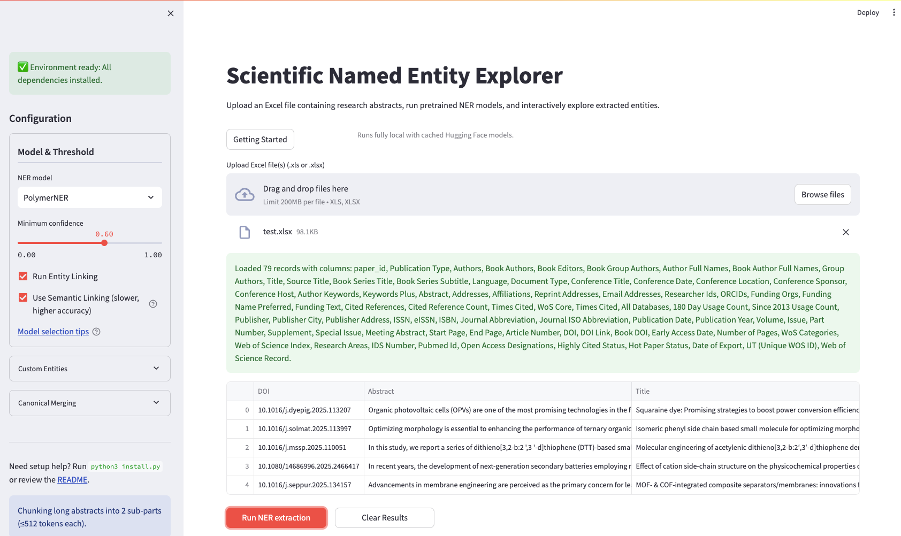

<p align="center">
  
</p>

<h1 align="center">🔬 Scientific Named Entity Explorer</h1>

<!-- The following Markdown heading is intentionally hidden to fix GitHub TOC anchor generation -->
<!--
# Scientific Named Entity Explorer
-->


<p align="center">
  Interactive Streamlit app for mining scientific literature using pretrained Named-Entity-Recognition (NER) models.
</p>

<p align="center">
  <a href="https://www.python.org/"></a>
  
  
  
  
</p>

---

## 📌 Overview

The **Scientific Named Entity Explorer** is an interactive tool for automated extraction of scientific entities from research abstracts.  
It supports upload from Excel sheets and provides:

- 🧠 **Pretrained scientific NER models**
- 🎛️ **Rich filters & configurable thresholds**
- 🔍 **Entity-level visualization as colored chips**
- 📊 **Summaries and downloadable reports**
- ⚡ **Fast local execution via Streamlit**

---

## 📚 Table of Contents
- [Prerequisites](#-prerequisites)
- [Quick Start](#-quick-start)
- [Step-by-Step Installation](#%EF%B8%8F-step-by-step-installation)
- [Using the App](#%EF%B8%8F-using-the-app)
- [Troubleshooting](#-troubleshooting)
- [Screenshots](#-example-screenshots)
- [Contributing](#-contributing)

---

## 🧩 Prerequisites
- Python **3.10+**
- `git` (optional)
- Internet connection (initial model download)

> ⚠️ Note: Pretrained models and PyTorch wheels are large. Ensure sufficient disk space.

---

## 🚀 Quick Start

```bash
git clone https://github.com/Rkl2023/Named_entity_algorithm_project.git
cd Named_entity_algorithm_project
python3 install.py
source .venv/bin/activate  # Windows: .venv\Scripts\activate
streamlit run app.py
```

## 🛠️ Step-by-Step Installation

### 1. Clone the project
```bash
git clone https://github.com/k25063738/Named_entity_algorithm_project
cd Named_entity_algorithm_project
```

### 2. Create + activate virtual environment
```bash
python3 -m venv .venv
source .venv/bin/activate      # macOS/Linux
# .venv\Scripts\activate       # Windows
```

### 3. Install dependencies
```bash
pip install --upgrade pip
pip install -r requirements.txt
```

### 4. Launch the app
```bash
streamlit run app.py
```

> Prefer automation?  
> `python3 install.py` handles everything for you.

---

## 🕹️ Using the App

1. Activate your virtual environment  
2. Run:
   ```bash
   streamlit run app.py
   ```
3. Open Streamlit tab (default: http://localhost:8501)  
4. Select NER model + confidence threshold  
5. Upload Excel file (Title + Abstract required)  
6. Click **Run NER Extraction** to:
   - Process abstracts with model  
   - Display entities as colored chips  
   - Filter by keyword / entity type  
7. Download results as **CSV / JSON / Excel**

---

## 🐞 Troubleshooting

### 🔧 `pip` cannot find a matching `torch` wheel
```bash
pip install --upgrade pip
```
Apple Silicon users may need wheels from:  
👉 https://pytorch.org/

---

### 🐢 Model download slow
First run downloads large models.  
Subsequent runs use:
```
~/.cache/huggingface/
```

---

### ❌ `streamlit` not found
Activate virtual environment:
```bash
source .venv/bin/activate
```

---

### ❗ Excel upload fails
Ensure required columns:
- `Title`
- `Abstract`

---

### 🧮 Performance issues
- Split very large Excel files  
- Increase confidence threshold  

---

## 📸 Example Screenshots

### 🖥️ Main Interface


---

## 🤝 Contributing

Feel free to open issues or submit PRs.

<p align="center">⭐ If you find this project useful, consider giving it a star!</p>
